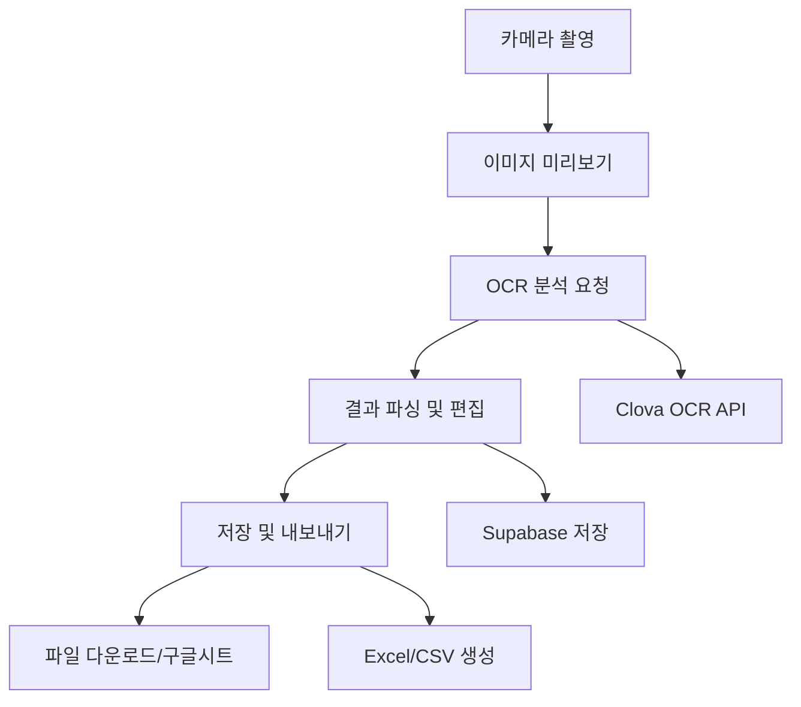

# NeimScan PWA 개발 작업계획서

> 축의금 봉투 손글씨를 OCR로 인식하여 디지털화하는 Progressive Web App

## 📋 프로젝트 개요

| 항목 | 내용 |
|------|------|
| **프로젝트명** | NeimScan |
| **타입** | Progressive Web App (PWA) |
| **목적** | 축의금 봉투 등 손글씨 텍스트를 OCR로 인식하여 디지털화 |
| **타겟 플랫폼** | Safari 포함 모든 모던 브라우저 |
| **개발 기간** | 약 10일 (2주) |
| **개발 인력** | 1명 (풀스택 개발자) |

### 🛠️ 주요 기술 스택
- **Frontend**: Next.js 15, TypeScript, Tailwind CSS
- **PWA**: next-pwa, Service Worker
- **OCR**: Clova OCR API
- **Database**: Supabase
- **Export**: xlsx, CSV, Google Sheets API
- **Camera**: react-webcam, getUserMedia API

## 🎯 핵심 기능 요구사항

### ✅ PWA 기본 기능
- [ ] Safari에서 설치 가능한 PWA
- [ ] 오프라인 지원 (기본 UI)
- [ ] 반응형 디자인 (모바일 우선)
- [ ] Add to Home Screen (A2HS) 지원

### 📷 카메라 기능
- [ ] 디바이스 카메라 접근 권한 요청
- [ ] 실시간 카메라 미리보기
- [ ] 사진 촬영 및 저장
- [ ] 이미지 품질 최적화

### 🔍 OCR 기능
- [ ] Clova OCR API 연동
- [ ] 한글/한자 텍스트 인식
- [ ] 이미지 전처리 (필요시)
- [ ] 인식 결과 파싱

### 💾 데이터 관리
- [ ] 인식 결과 편집 UI
- [ ] Supabase 데이터베이스 저장
- [ ] 엑셀/CSV 내보내기
- [ ] 구글 시트 연동 (선택사항)

## 📁 프로젝트 구조

```
src/
├── app/
│   ├── api/
│   │   └── ocr/
│   │       └── route.ts              # Clova OCR API 핸들러
│   ├── globals.css
│   ├── layout.tsx
│   ├── page.tsx                      # 메인 페이지
│   └── manifest.ts                   # PWA 매니페스트
├── components/
│   ├── camera/
│   │   ├── CameraCapture.tsx         # 카메라 캡처 컴포넌트
│   │   └── ImagePreview.tsx          # 이미지 미리보기
│   ├── ocr/
│   │   ├── ResultEditor.tsx          # OCR 결과 편집
│   │   └── NameExtractor.tsx         # 이름/금액 추출 로직
│   ├── export/
│   │   └── ExportOptions.tsx         # 내보내기 옵션
│   └── ui/
│       ├── Button.tsx
│       ├── Input.tsx
│       └── Loading.tsx
├── hooks/
│   ├── useClovaOCR.ts               # OCR API 호출 훅
│   ├── useCamera.ts                 # 카메라 제어 훅
│   └── useSupabase.ts               # Supabase 연동 훅
├── lib/
│   ├── supabase.ts                  # Supabase 설정
│   ├── ocr-parser.ts                # OCR 결과 파싱 유틸
│   └── excel-exporter.ts            # 엑셀 내보내기 유틸
├── types/
│   ├── ocr.ts                       # OCR 관련 타입
│   └── database.ts                  # DB 스키마 타입
└── utils/
    ├── image-processor.ts           # 이미지 처리 유틸
    └── constants.ts                 # 상수 정의
```

## 🗄️ 데이터베이스 스키마 (Supabase)

```sql
-- 축의금 기록 테이블
CREATE TABLE celebrations (
  id UUID DEFAULT gen_random_uuid() PRIMARY KEY,
  created_at TIMESTAMP WITH TIME ZONE DEFAULT NOW(),
  updated_at TIMESTAMP WITH TIME ZONE DEFAULT NOW(),
  
  -- 이미지 정보
  image_url TEXT,
  original_filename TEXT,
  
  -- OCR 원본 결과
  ocr_raw_text TEXT,
  ocr_confidence FLOAT,
  
  -- 파싱된 정보
  guest_name TEXT NOT NULL,
  amount INTEGER,
  amount_text TEXT,
  relationship TEXT,
  notes TEXT,
  
  -- 메타데이터
  event_name TEXT,
  event_date DATE,
  user_id UUID REFERENCES auth.users(id)
);

-- 인덱스 생성
CREATE INDEX idx_celebrations_user_id ON celebrations(user_id);
CREATE INDEX idx_celebrations_event_date ON celebrations(event_date);
CREATE INDEX idx_celebrations_created_at ON celebrations(created_at);
```

## 🔧 단계별 개발 계획

### 1️⃣ 단계 1: 프로젝트 초기 설정 (1일)
**목표**: 기본 프로젝트 구조 및 환경 설정

#### 작업 항목:
- [ ] Next.js 15 프로젝트 초기화
- [ ] TypeScript, Tailwind CSS 설정
- [ ] PWA 설정 (next-pwa)
- [ ] 환경변수 설정 (.env.local)
- [ ] Supabase 프로젝트 생성 및 연동
- [ ] 기본 UI 컴포넌트 작성

#### 필요한 패키지:
```json
{
  "dependencies": {
    "next": "^15.0.0",
    "react": "^18.0.0",
    "react-dom": "^18.0.0",
    "typescript": "^5.0.0",
    "@supabase/supabase-js": "^2.0.0",
    "xlsx": "^0.18.0",
    "react-webcam": "^7.0.0"
  },
  "devDependencies": {
    "next-pwa": "^5.6.0",
    "tailwindcss": "^3.0.0",
    "@types/node": "^20.0.0",
    "@types/react": "^18.0.0"
  }
}
```

#### 환경변수:
```env
# Clova OCR
NEXT_PUBLIC_CLOVA_OCR_INVOKE_URL=
CLOVA_OCR_SECRET_KEY=

# Supabase
NEXT_PUBLIC_SUPABASE_URL=
NEXT_PUBLIC_SUPABASE_ANON_KEY=
SUPABASE_SERVICE_ROLE_KEY=

# 기타
NEXT_PUBLIC_APP_URL=http://localhost:3000
```

### 2️⃣ 단계 2: Clova OCR API 연동 (1일)
**목표**: OCR 기능 구현 및 테스트

#### 작업 항목:
- [ ] `/api/ocr/route.ts` API 라우트 구현
- [ ] Clova OCR API 호출 로직
- [ ] 이미지 업로드 및 base64 변환
- [ ] OCR 결과 파싱 유틸리티
- [ ] 에러 처리 및 재시도 로직

#### 핵심 파일:
```typescript
// src/app/api/ocr/route.ts
export async function POST(request: Request) {
  // Clova OCR API 호출 로직
}

// src/hooks/useClovaOCR.ts
export const useClovaOCR = () => {
  // OCR 호출 및 상태 관리
}

// src/lib/ocr-parser.ts
export const parseOCRResult = (ocrText: string) => {
  // 이름, 금액 등 정보 추출
}
```

### 3️⃣ 단계 3: 카메라 기능 구현 (2일)
**목표**: 카메라 촬영 및 이미지 처리

#### 작업 항목:
- [ ] 카메라 권한 요청 처리
- [ ] 실시간 카메라 미리보기
- [ ] 사진 촬영 기능
- [ ] 이미지 품질 최적화
- [ ] 다중 이미지 촬영 지원

#### 핵심 컴포넌트:
```typescript
// src/components/camera/CameraCapture.tsx
export const CameraCapture = () => {
  // 카메라 제어 로직
}

// src/components/camera/ImagePreview.tsx
export const ImagePreview = () => {
  // 촬영된 이미지 미리보기
}

// src/hooks/useCamera.ts
export const useCamera = () => {
  // 카메라 상태 관리
}
```

### 4️⃣ 단계 4: OCR 결과 처리 및 편집 UI (2일)
**목표**: OCR 결과 표시 및 사용자 편집 기능

#### 작업 항목:
- [ ] OCR 결과 표시 UI
- [ ] 인식된 텍스트 편집 기능
- [ ] 이름/금액 자동 분류
- [ ] 수동 분류 옵션
- [ ] 실시간 입력 검증

#### 핵심 컴포넌트:
```typescript
// src/components/ocr/ResultEditor.tsx
export const ResultEditor = () => {
  // OCR 결과 편집 인터페이스
}

// src/components/ocr/NameExtractor.tsx
export const NameExtractor = () => {
  // 이름/금액 추출 및 분류
}
```

### 5️⃣ 단계 5: 데이터 저장 및 관리 (1일)
**목표**: Supabase 연동 및 데이터 CRUD

#### 작업 항목:
- [ ] Supabase 클라이언트 설정
- [ ] 데이터 저장 기능
- [ ] 저장된 데이터 조회
- [ ] 데이터 수정/삭제
- [ ] 사용자 인증 (선택사항)

#### 핵심 파일:
```typescript
// src/lib/supabase.ts
export const supabase = createClient()

// src/hooks/useSupabase.ts
export const useSupabase = () => {
  // CRUD 작업 관리
}
```

### 6️⃣ 단계 6: 내보내기 기능 구현 (2일)
**목표**: 엑셀/CSV/구글시트 내보내기

#### 작업 항목:
- [ ] 엑셀 파일 생성 (xlsx)
- [ ] CSV 파일 생성
- [ ] 구글 시트 API 연동
- [ ] 파일 다운로드 기능
- [ ] 내보내기 옵션 UI

#### 핵심 파일:
```typescript
// src/lib/excel-exporter.ts
export const exportToExcel = (data: CelebrationData[]) => {
  // 엑셀 파일 생성 로직
}

// src/components/export/ExportOptions.tsx
export const ExportOptions = () => {
  // 내보내기 옵션 UI
}
```

### 7️⃣ 단계 7: PWA 기능 완성 (1일)
**목표**: PWA 설정 및 최적화

#### 작업 항목:
- [ ] 매니페스트 파일 설정
- [ ] 서비스 워커 구성
- [ ] 오프라인 지원
- [ ] A2HS 구현
- [ ] 아이콘 및 스크린샷 준비

#### 핵심 파일:
```typescript
// src/app/manifest.ts
export default function manifest(): MetadataRoute.Manifest {
  // PWA 매니페스트 설정
}

// public/sw.js
// 서비스 워커 로직
```

### 8️⃣ 단계 8: 최종 테스트 및 배포 (1일)
**목표**: 전체 기능 테스트 및 프로덕션 배포

#### 작업 항목:
- [ ] 전체 플로우 테스트
- [ ] 다양한 디바이스/브라우저 테스트
- [ ] 성능 최적화
- [ ] Vercel/Netlify 배포
- [ ] 도메인 설정 및 HTTPS

## 📊 성능 및 품질 기준

### 성능 목표:
- [ ] Lighthouse PWA 점수 90+
- [ ] 첫 페이지 로딩 시간 < 3초
- [ ] 카메라 촬영 응답 시간 < 1초
- [ ] OCR 처리 시간 < 10초

### 사용성 기준:
- [ ] 모바일 터치 인터페이스 최적화
- [ ] 접근성 (WCAG 2.1 AA 준수)
- [ ] 다국어 지원 준비 (한국어 우선)
- [ ] 에러 처리 및 사용자 피드백

## 🔄 향후 확장 계획

### Phase 2 기능:
- [ ] 사용자 계정 및 인증
- [ ] 행사별 데이터 그룹핑
- [ ] 통계 및 분석 대시보드
- [ ] QR코드 생성 및 공유

### Phase 3 기능:
- [ ] 실시간 협업 기능
- [ ] AI 기반 글씨체 학습
- [ ] 클라우드 백업 및 동기화
- [ ] 모바일 앱 (React Native)

## 🚀 개발 플로우



## 📅 전체 일정

| 단계 | 작업 내용 | 소요 시간 | 담당자 |
|------|-----------|----------|--------|
| 1 | 프로젝트 초기 설정 | 1일 | 개발자 |
| 2 | Clova OCR API 연동 | 1일 | 개발자 |
| 3 | 카메라 기능 구현 | 2일 | 개발자 |
| 4 | OCR 결과 처리 및 편집 UI | 2일 | 개발자 |
| 5 | 데이터 저장 및 관리 | 1일 | 개발자 |
| 6 | 내보내기 기능 구현 | 2일 | 개발자 |
| 7 | PWA 기능 완성 | 1일 | 개발자 |
| 8 | 최종 테스트 및 배포 | 1일 | 개발자 |

**총 개발 기간**: 10일 (약 2주)

## 🔗 유용한 링크

- [Next.js 15 Documentation](https://nextjs.org/docs)
- [Clova OCR API 문서](https://apidocs.ncloud.com/ko/ai-application-service/ocr/)
- [Supabase Documentation](https://supabase.com/docs)
- [PWA 가이드](https://web.dev/progressive-web-apps/)
- [Tailwind CSS](https://tailwindcss.com/docs)

## 📝 커밋 컨벤션

```
feat: 새로운 기능 추가
fix: 버그 수정
docs: 문서 수정
style: 코드 포맷팅, 세미콜론 누락, 코드 변경이 없는 경우
refactor: 코드 리팩토링
test: 테스트 코드, 리팩토링 테스트 코드 추가
chore: 빌드 업무 수정, 패키지 매니저 수정
```

## 🤝 기여 가이드

1. 이슈 등록 또는 기존 이슈 확인
2. 새로운 브랜치 생성 (`git checkout -b feature/amazing-feature`)
3. 변경사항 커밋 (`git commit -m 'feat: Add amazing feature'`)
4. 브랜치에 푸시 (`git push origin feature/amazing-feature`)
5. Pull Request 생성

## 📄 라이센스

이 프로젝트는 MIT 라이센스를 따릅니다. 자세한 내용은 [LICENSE](LICENSE) 파일을 참조하세요.

---

**개발 시작일**: 2025년 6월 13일  
**예상 완료일**: 2025년 6월 27일  
**최종 업데이트**: 2025년 6월 13일